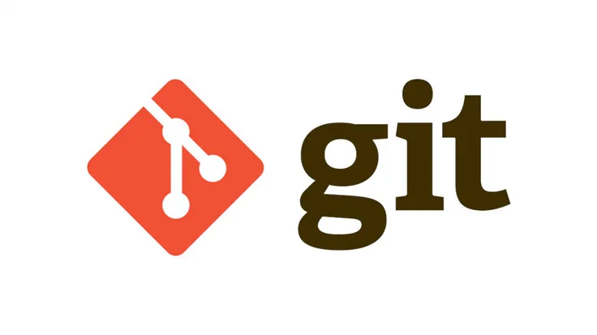

# Software Engineer & Tech Trainer  

<h2><b>Empowering Minds Through Code 🖥️</b></h2>

- **@[Standford Code In Place 25'](https://www.linkedin.com/posts/hassan-mehmood413_stanfordcip2025-sectionleader-teachingcode-activity-7316630528353275904-CvE3?utm_source=share&utm_medium=member_desktop&rcm=ACoAAD0autYBDWMLUgrU35ZTKZlWjbKtYVD0RLw)** Selected as Section Leader at Standford Code In Place 2025.
- **@[Leetcode](https://leetcode.com/u/Hassan_Leigons/)** Solved 550+ Data Structures & Algorithms problems on Leetcode.
- **@[iCodeGuru](https://github.com/HassanMehmood413/My_All_Lectures-ICodeGuru-)**: Offers volunteer teaching in Python and DSA, emphasizing LeetCode.
- If you want to see how I provide training to my students @**[ICodeGuru](https://icode.guru/)**.
- **See My Training** → **[**👀**](https://github.com/HassanMehmood413/My_All_Lectures-ICodeGuru-)**.
- **@[LabLab.ai](https://lablab.ai/u/@hassan_mehmood517)**: Participated in multiple AI International Hackathons with a global team of six.
- **@[Major League Hacking](https://github.com/HassanMehmood413/Orbit-Rangers)**: Participated in ***Hack This Fall 36 Hours Virtual 2024*** Hackathon with a global team of four. 
- **@[Meta Hacker Cup](https://github.com/HassanMehmood413/Meta_Hacker_Cup-2024-)**: Participated in Meta Hacker Cup **2024** where Me and my team tackled complex problems and solve them.
- **@[MITIT Coding Competition](https://github.com/HassanMehmood413/M-IT-2-Coding-Competition-2024/)**: Participated in MITIT Coding Contest Cup **2025** where my team solved Begineer and Advance level problems and ranked 198th. 
- **@[Advent Of Code](https://github.com/HassanMehmood413/Advent-Of-Code-2024-Competition)**: Participated in Advent Of Code **2024** and Solve complex problems from **Day 0 - 25**.
- **@[UC Berkeley Coding Competition](https://github.com/HassanMehmood413/UC_Berkeley_Coding_Competition_2024)**: Participated in UC Berkeley Competition  **2024** where I work with International Engineers and solve complex problems.
- **@[Typing Speed](https://www.linkedin.com/posts/hassan-mehmood-01a3a9247_%F0%9D%90%93%F0%9D%90%B2%F0%9D%90%A9%F0%9D%90%A2%F0%9D%90%A7%F0%9D%90%A0-%F0%9D%90%92%F0%9D%90%A9%F0%9D%90%9E%F0%9D%90%9E%F0%9D%90%9D-%F0%9D%90%94%F0%9D%90%A9%F0%9D%90%9D%F0%9D%90%9A%F0%9D%90%AD%F0%9D%90%9E-assalam-u-allikum-activity-7246426571517943808-R69q?utm_source=share&utm_medium=member_desktop)** More than 88WPM (Words Per Minute).

<h2><i>💻 Tech Stack and Tools</i></h2>

<table width="100">

<tr>
    <td align='center'>
        
    </td>
    <td align='center' width="190">
        
    </td>
    <td align='center'>
        
    </td>
    <td align='center'>
        
    </td>
     <td align='center'>
        
    </td>
</tr>
 
<tr>
    <td align='center' width="190">
        
    </td>
    <td align='center' width="190">
        
    </td>
     <td align='center' width="190">
        
    </td>
     <td align='center' width="190">
        
    </td>
     <td align='center' width="190">
        
    </td>
</tr>
<tr>
    <td align='center'>
        
    </td>
    <td align='center'>
        
    </td>
    <td align='center'>
        
    </td>
	<td align='center'>
        
    </td>
    <td align='center'>
        
    </td>
</tr>
<tr>
    <td align='center'>
        
    </td>
<td align='center'>
        
    </td>
	<td align='center'>
        
    </td>
    <td align='center'>
        
    </td>
	<td align='center'>
        
    </td>
</tr>

<tr>
    <td align='center' width="190">
        
    </td>
    <td align='center'>
        
    </td>
    <td align='center'>
        
    </td>
     <td align='center'>
        
    </td>
</tr>

</table>

 
 

## Connect with Me 🤝

  

  <h2><i>⚙️ GitHub Analytics</i></h2>

  

## COMPLETED INTERNATIONAL HACKATHONS🥇:

  
	
<a href="https://github.com/row-huh/MalamaAI">
     
  </a
	  
  <a href="https://github.com/HassanMehmood413/AI_Emotions_Analysis">
     
  </a
	  
  
  
  <a href="https://github.com/umarwar/TechEase">
     
  </a
	  
   <a href="https://github.com/danishmustafa86/AI-AGENT">
     
  </a
	  
  <a href="https://github.com/HassanMehmood413/AI-Audio-Assistant">
     
  </a
	
  <a href="https://github.com/HassanMehmood413/AI-blogs">
     
  </a

   

  

<!-- # Github Contributions
<h4 align="center">Isometric view of contributions in the last year.</h4>

	

 -->

<!-- # Github Metrics

	

 --> 
